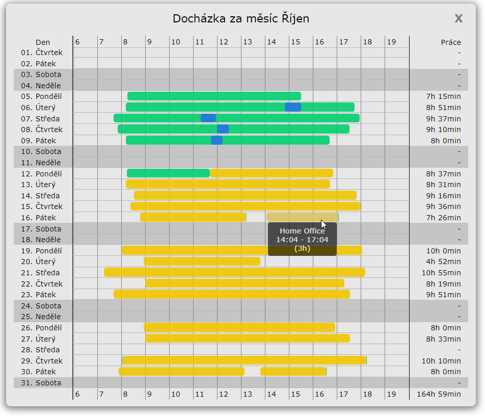
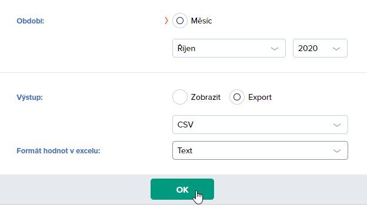

## [EN] Fingera attendance preview

This project focuses on displaying your work attendance in a nice visual way. It is intended to work with our company's attendance system Fingera.

It only supports Czech locale as for now. Contact me if you would like to support English or any other language.

[Live preview](https://papooch.github.io/fingera_attendance_preview/)

----------

## [CS] Fingera attendance preview

Jelikož měsíční report docházky ve Fingeře je naprosto tragický a absolutně se v něm nedá vyznat, vytvořil jsem jednoduchou appku pro vizualizaci exportovaného CSV souboru s docházkou.

Známé problémy:
 * Diagram graficky podporuje pouze záznamy "Práce", "Oběd" a "Home Office", ostatní se zobrazí růžově, ale čas by se měl počítat správně i tak.

Další kroky:
 * Vytvořit rozšíření do prohlížeče, které zobrazí tento přehled přímo na stránce Fingery, aby nebylo nutné report stahovat.  

[Funkční verze k dispozici zde](https://papooch.github.io/fingera_attendance_preview/)

Screenshot:

Volba exportu ve Fingeře:
