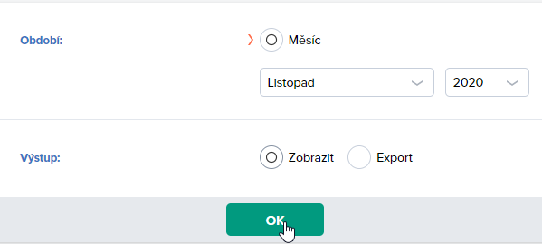
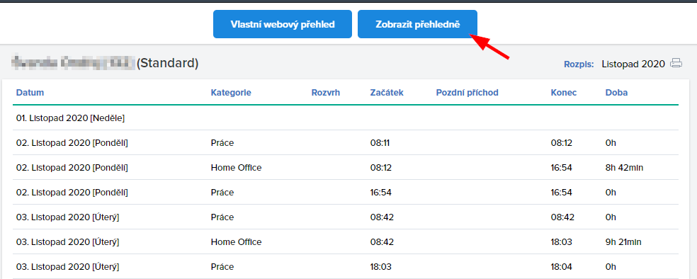

## [EN] Fingera attendance preview

This project focuses on displaying your work attendance in a nice visual way. It is intended to work with our company's attendance system Fingera.

It only supports Czech locale as for now. Contact me if you would like to support English or any other language.

[Live preview](https://papooch.github.io/fingera_attendance_preview/)

----------

## [CS] Fingera attendance preview

Jelikož měsíční report docházky ve Fingeře je naprosto tragický a absolutně se v něm nedá vyznat, vytvořil jsem jednoduchou appku pro vizualizaci exportovaného CSV souboru s docházkou.

Projekt funguje jako webová stránka ([Funkční verze k dispozici zde](https://papooch.github.io/fingera_attendance_preview/)) a zároveň jako rozšíření do prohlížeče (ověřena funkčnost v Chrome, Opera, Firefox).

### Použití:
* **A)** Webová stránka:  
  Na prázdnou oblast přetáhněte (nebo vyberte ze sytémového dialogu) vyexportovaný soubor měsíční docházky ve formátu CSV.

* **B)** Rozšíření do prohlížeče:  
  Rozšíření přidává do záhlaví přehledu docházky na `fingera.com` další tlačítko "Zobrazit přehledně". Kliknutí na něj vygeneruje tentýž přehled jako v A).  
  Rozšíření lze nainstalovat při zapnutí vývojářského módu ve vašem prohlížeči.  
  *TODO #1: návod na instalaci v jednotlivých prohlížečích*,  
  *TODO #2: publikovat rozšíření na distribuční platformy jednotlivých prohlížečů*

### Další postup:
* Zobrazení právě probíhající činnosti

### Známé problémy:
 * Celkový odpracovaný čas za měsíc nesedí přesně s časem, který ukazuje Fingera, protože přehled obsahuje pouze časy zaokrouhlené na celé minuty, přičemž samotná Fingera pracuje i se sekundami.

 * Diagram graficky podporuje pouze záznamy "Práce", "Oběd" a "Home Office", ostatní se zobrazí růžově, ale čas práce by se měl ve většině případů, kromě "návštěva u lékaře" počítat správně.

Screenshot:

Volba exportu měsíční docházky z Fingeře:

Volba zobrazení docházky přímo na stránce Fingery:

Nové tlačítko, které přidá rozšíření na stránku měsíčního přehledu:
